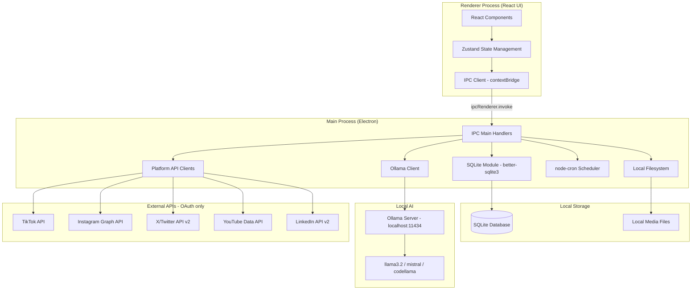
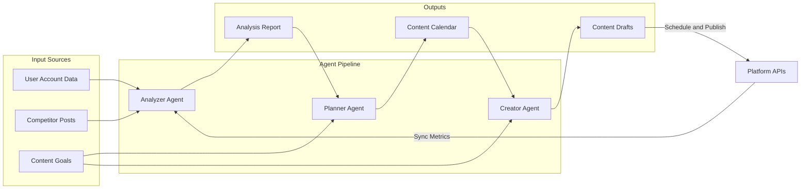
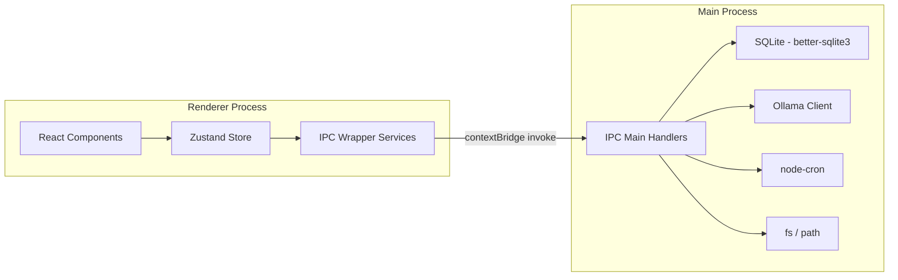
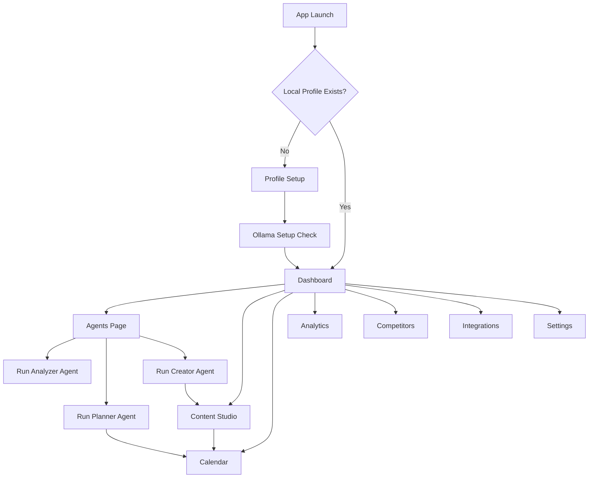
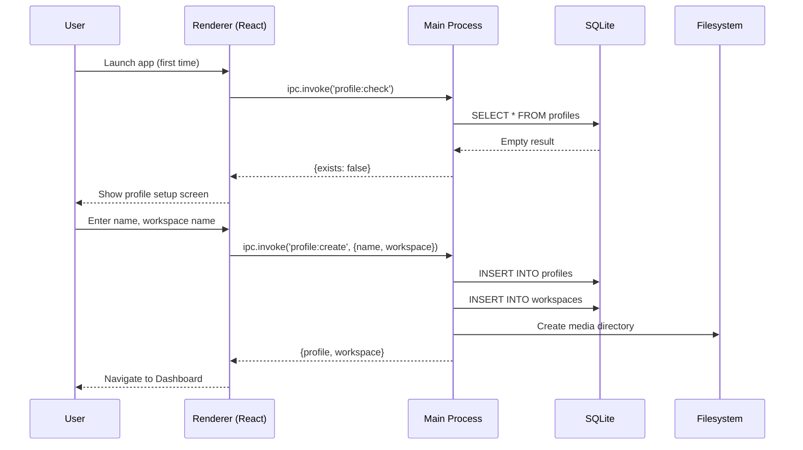
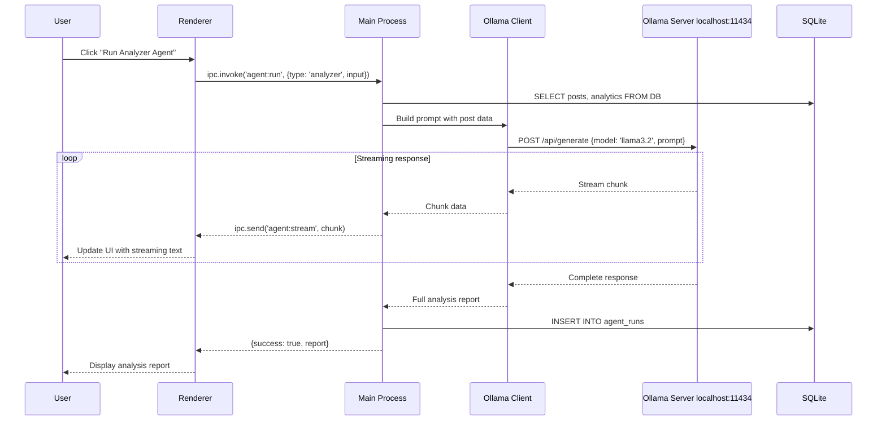
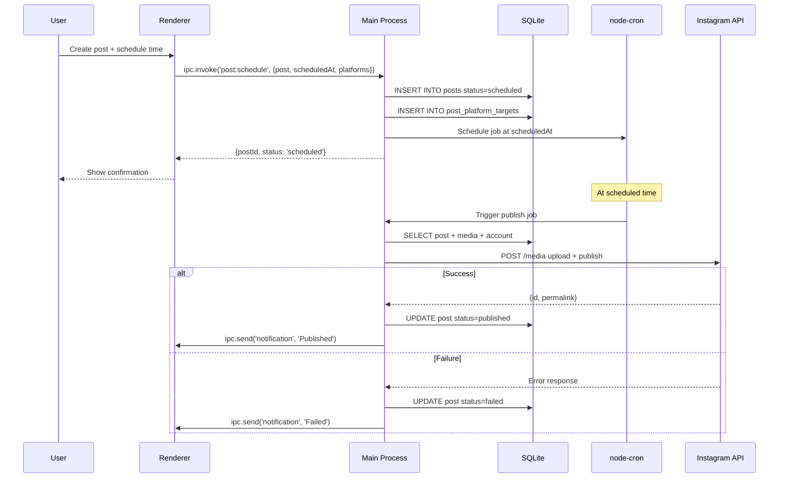
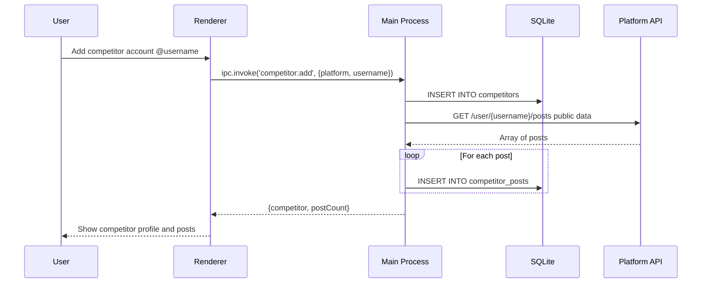
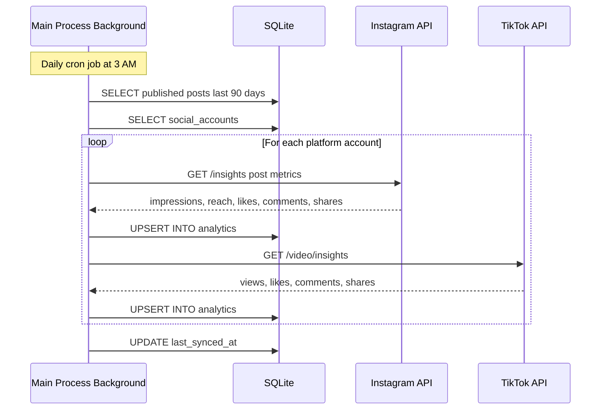

# Design Document: Agentrix MVP

## Overview

Agentrix is a cross-platform desktop application built with Electron, React, and TypeScript that empowers social media creators and content marketers to analyze, plan, create, and publish content across TikTok, Instagram, Twitter/X, YouTube, and LinkedIn — all powered by local AI agents running entirely on the user's machine.

The application extracts data from competitor posts and user accounts, then deploys three specialized AI agents in a pipeline: the **Analyzer Agent** evaluates SEO, writing quality, and platform algorithm performance; the **Planner Agent** generates intelligent 30-day content calendars with optimal posting times; and the **Creator Agent** produces platform-optimized captions, hashtags, video scripts, and visual recommendations. All content can be auto-published on schedule, with performance metrics synced back to create a continuous improvement feedback loop.

The architecture is fully offline-first. All AI inference runs locally via Ollama (llama3.2, mistral, or similar), all data is stored in a local SQLite database via better-sqlite3, and media is stored on the local filesystem. No cloud backend is required after the initial platform OAuth setup. The Electron main process acts as the application server — hosting the SQLite database, Ollama client, platform API clients, and node-cron scheduler — while the React renderer communicates with it exclusively through Electron's IPC contextBridge. The design philosophy is minimal, structured, and premium — inspired by Linear, Notion, and Arc Browser — with a dark design system using TailwindCSS, shadcn/ui, and Framer Motion.

## Architecture

### System Architecture Overview



### Three-Agent Pipeline



### Electron IPC Architecture



### Application Navigation Flow



## Sequence Diagrams

### Local Profile Setup Flow



### Ollama AI Agent Execution Flow



### Content Publishing Flow (Local Scheduler)



### Competitor Data Extraction Flow



### Analytics Sync Flow



## Components and Interfaces

### Component 1: ProfileModule

**Purpose**: Manages local user profiles and workspaces. Replaces cloud auth — no JWT, no email verification. Profiles are stored in SQLite and identified locally.

**Interface**:
```typescript
interface ProfileService {
  getActiveProfile(): Promise<Profile | null>
  createProfile(data: CreateProfileData): Promise<Profile>
  updateProfile(id: string, data: Partial<CreateProfileData>): Promise<Profile>
  listWorkspaces(profileId: string): Promise<Workspace[]>
  createWorkspace(data: CreateWorkspaceData): Promise<Workspace>
  switchWorkspace(id: string): Promise<void>
  getActiveWorkspace(): Workspace | null
}

interface Profile {
  id: string
  name: string
  avatarPath?: string           // Local file path
  createdAt: Date
  updatedAt: Date
}

interface Workspace {
  id: string
  profileId: string
  name: string
  timezone: string              // IANA timezone string
  defaultLanguage: string       // ISO 639-1
  createdAt: Date
  updatedAt: Date
}
```

**Responsibilities**:
- Create and persist local profiles in SQLite on first launch
- Scope all content, posts, and analytics to the active workspace
- Persist active workspace selection across sessions (electron-store)
- No network calls — fully local

### Component 2: AgentModule

**Purpose**: Orchestrates the three AI agents (Analyzer, Planner, Creator) by building prompts, calling Ollama, streaming responses to the renderer, and persisting agent run history.

**Interface**:
```typescript
interface AgentService {
  runAnalyzer(input: AnalyzerInput): AsyncGenerator<string, AnalyzerOutput>
  runPlanner(input: PlannerInput): AsyncGenerator<string, PlannerOutput>
  runCreator(input: CreatorInput): AsyncGenerator<string, CreatorOutput>
  getAgentRuns(workspaceId: string, agentType?: AgentType): Promise<AgentRun[]>
  getAgentRun(runId: string): Promise<AgentRun>
}

type AgentType = 'analyzer' | 'planner' | 'creator'

interface AnalyzerInput {
  workspaceId: string
  posts: Post[]
  competitorPosts?: CompetitorPost[]
  platforms: SocialPlatform[]
}

interface AnalyzerOutput {
  seoScore: number              // 0-100
  readabilityScore: number      // 0-100
  hashtagEffectiveness: number  // 0-100
  algorithmAlignmentScore: number // 0-100
  suggestions: string[]
  topPerformingPatterns: string[]
}

interface PlannerInput {
  workspaceId: string
  analyzerOutput: AnalyzerOutput
  competitorData: CompetitorPost[]
  contentGoals: string
  platforms: SocialPlatform[]
  daysAhead: number             // Default: 30
}

interface PlannerOutput {
  calendarSlots: ContentCalendarSlot[]
  topicSuggestions: string[]
  optimalPostingTimes: Record<SocialPlatform, OptimalTime[]>
}

interface CreatorInput {
  workspaceId: string
  topic: string
  platform: SocialPlatform
  tone: ContentTone
  targetAudience: string
  plannerSlot?: ContentCalendarSlot
}

interface CreatorOutput {
  caption: string
  hashtags: string[]
  videoScript?: string
  visualRecommendations: string[]
  alternativeVersions: string[]
}

interface AgentRun {
  id: string
  workspaceId: string
  agentType: AgentType
  inputSnapshot: string         // JSON string of input
  outputSnapshot: string        // JSON string of output
  modelUsed: string             // e.g. "llama3.2"
  durationMs: number
  status: 'running' | 'completed' | 'failed'
  errorMessage?: string
  createdAt: Date
}

type ContentTone = 'professional' | 'casual' | 'humorous' | 'inspirational' | 'educational'
```

**Responsibilities**:
- Build platform-aware, structured prompts for each agent type
- Stream Ollama responses back to renderer via IPC `agent:stream` events
- Parse and validate structured JSON output from LLM responses
- Persist every agent run to `agent_runs` table for history and replay
- Handle Ollama unavailability gracefully (check health before running)

### Component 3: OllamaModule

**Purpose**: Low-level client for communicating with the local Ollama server. Handles model management, health checks, and streaming inference.

**Interface**:
```typescript
interface OllamaClient {
  checkHealth(): Promise<OllamaHealth>
  listModels(): Promise<OllamaModel[]>
  generate(request: OllamaGenerateRequest): AsyncGenerator<string>
  chat(request: OllamaChatRequest): AsyncGenerator<string>
  pullModel(modelName: string): AsyncGenerator<PullProgress>
  getConfig(): OllamaConfig
  updateConfig(config: Partial<OllamaConfig>): Promise<void>
}

interface OllamaHealth {
  isRunning: boolean
  version?: string
  availableModels: string[]
}

interface OllamaConfig {
  baseUrl: string               // Default: http://localhost:11434
  defaultModel: string          // Default: llama3.2
  timeoutMs: number             // Default: 120000
  maxTokens: number             // Default: 2048
  temperature: number           // Default: 0.7
}

interface OllamaGenerateRequest {
  model: string
  prompt: string
  stream: boolean
  options?: { temperature?: number; num_predict?: number }
}

interface OllamaChatRequest {
  model: string
  messages: Array<{ role: 'system' | 'user' | 'assistant'; content: string }>
  stream: boolean
}

interface OllamaModel {
  name: string
  size: number
  modifiedAt: Date
}

interface PullProgress {
  status: string
  completed?: number
  total?: number
}
```

**Responsibilities**:
- Verify Ollama is running before any agent execution
- Stream token-by-token responses and forward via IPC
- Manage model configuration stored in `ollama_config` SQLite table
- Provide model pull progress for the Settings page

### Component 4: ContentStudioModule

**Purpose**: Core content creation interface — draft management, local media upload, caption writing, hashtag management, and AI-assisted creation via the Creator Agent.

**Interface**:
```typescript
interface ContentStudioService {
  createDraft(data: CreatePostData): Promise<Post>
  updateDraft(id: string, data: Partial<CreatePostData>): Promise<Post>
  deleteDraft(id: string): Promise<void>
  uploadMedia(filePath: string, workspaceId: string): Promise<MediaAsset>
  deleteMedia(mediaId: string): Promise<void>
  listDrafts(workspaceId: string, filters?: PostFilters): Promise<Post[]>
  duplicatePost(id: string): Promise<Post>
  applyCreatorOutput(draftId: string, output: CreatorOutput): Promise<Post>
}

interface CreatePostData {
  workspaceId: string
  caption: string
  mediaIds: string[]
  platforms: SocialPlatform[]
  hashtags: string[]
  ctaNotes?: string
  scheduledAt?: Date
}

interface Post {
  id: string
  workspaceId: string
  caption: string
  media: MediaAsset[]
  platforms: PostPlatformTarget[]
  hashtags: string[]
  ctaNotes?: string
  status: PostStatus
  scheduledAt?: Date
  publishedAt?: Date
  failureReason?: string
  retryCount: number
  createdAt: Date
  updatedAt: Date
}

interface MediaAsset {
  id: string
  workspaceId: string
  localPath: string             // Absolute path on local filesystem
  fileName: string
  mimeType: string
  fileSizeBytes: number
  width?: number
  height?: number
  durationSeconds?: number
  createdAt: Date
}

type PostStatus = 'draft' | 'scheduled' | 'publishing' | 'published' | 'failed'
type SocialPlatform = 'instagram' | 'tiktok' | 'twitter' | 'youtube' | 'linkedin'
```

**Responsibilities**:
- Copy uploaded media to the app's local media directory (not S3)
- Auto-save drafts on content change (debounced, 1500ms)
- Enforce character limits per platform (Twitter: 280, LinkedIn: 3000, TikTok: 2200, YouTube: 5000)
- Validate media file types and sizes per platform constraints
- Apply Creator Agent output directly to a draft

### Component 5: SchedulerModule

**Purpose**: Manages the content calendar, post scheduling, and publishing orchestration using node-cron running in the Electron main process.

**Interface**:
```typescript
interface SchedulerService {
  schedulePost(postId: string, scheduledAt: Date, platforms: SocialPlatform[]): Promise<ScheduledPost>
  reschedulePost(postId: string, newScheduledAt: Date): Promise<ScheduledPost>
  cancelSchedule(postId: string): Promise<void>
  getCalendarPosts(workspaceId: string, month: number, year: number): Promise<CalendarPost[]>
  getQueue(workspaceId: string): Promise<ScheduledPost[]>
  applyPlannerCalendar(workspaceId: string, slots: ContentCalendarSlot[]): Promise<void>
}

interface ScheduledPost {
  postId: string
  scheduledAt: Date
  platforms: SocialPlatform[]
  status: PostStatus
  cronJobId: string
}

interface CalendarPost {
  postId: string
  title: string
  scheduledAt: Date
  platforms: SocialPlatform[]
  status: PostStatus
  mediaLocalPath?: string
}

interface ContentCalendarSlot {
  id: string
  workspaceId: string
  scheduledAt: Date
  platform: SocialPlatform
  topic: string
  contentType: 'post' | 'reel' | 'story' | 'video' | 'thread'
  postId?: string               // Linked post if created
  createdByAgentRunId: string
  createdAt: Date
}

interface OptimalTime {
  dayOfWeek: number             // 0 = Sunday
  hour: number                  // 0-23 UTC
  engagementScore: number       // 0-100
}
```

**Responsibilities**:
- Register node-cron jobs in the main process for each scheduled post
- Restore scheduled jobs on app restart by reading `posts` table
- Handle timezone conversion (user local to UTC for storage)
- Apply Planner Agent calendar output as calendar slots
- Manage retry logic for failed publishing (max 3 retries, 15-min delay)

### Component 6: AnalyticsModule

**Purpose**: Aggregates and presents engagement metrics synced from platform APIs, with data stored locally in SQLite.

**Interface**:
```typescript
interface AnalyticsService {
  getOverview(workspaceId: string, dateRange: DateRange): Promise<AnalyticsOverview>
  getPostPerformance(postId: string): Promise<PostAnalytics>
  getTopPosts(workspaceId: string, limit: number): Promise<PostAnalytics[]>
  getEngagementTrend(workspaceId: string, dateRange: DateRange): Promise<TrendData[]>
  syncAnalytics(workspaceId: string): Promise<SyncResult>
  getMostActiveDays(workspaceId: string): Promise<ActivityHeatmap>
}

interface AnalyticsOverview {
  totalPosts: number
  totalEngagements: number
  avgEngagementRate: number
  followerGrowth: number
  topPlatform: SocialPlatform
  postingStreak: number
}

interface PostAnalytics {
  postId: string
  platform: SocialPlatform
  impressions: number
  reach: number
  likes: number
  comments: number
  shares: number
  saves: number
  videoViews?: number
  engagementRate: number
  fetchedAt: Date
}

interface SyncResult {
  synced: number
  failed: number
  errors: string[]
}

interface DateRange {
  from: Date
  to: Date
}
```

**Responsibilities**:
- Sync metrics from platform APIs and store in local SQLite `analytics` table
- Normalize metrics across platforms (each platform uses different field names)
- Calculate derived metrics (engagement rate = (likes + comments + shares) / reach x 100)
- Schedule daily background sync via node-cron
- Respect platform API rate limits with exponential backoff

### Component 7: CompetitorModule

**Purpose**: Tracks competitor accounts, extracts their public post data via platform APIs, and feeds that data into the Analyzer and Planner agents.

**Interface**:
```typescript
interface CompetitorService {
  addCompetitor(data: AddCompetitorData): Promise<Competitor>
  removeCompetitor(id: string): Promise<void>
  listCompetitors(workspaceId: string): Promise<Competitor[]>
  syncCompetitorPosts(competitorId: string): Promise<SyncResult>
  getCompetitorPosts(competitorId: string): Promise<CompetitorPost[]>
}

interface Competitor {
  id: string
  workspaceId: string
  platform: SocialPlatform
  platformUsername: string
  displayName?: string
  followerCount?: number
  lastSyncedAt?: Date
  createdAt: Date
}

interface CompetitorPost {
  id: string
  competitorId: string
  platformPostId: string
  caption?: string
  hashtags: string[]
  mediaType: 'image' | 'video' | 'carousel' | 'reel'
  likes: number
  comments: number
  shares: number
  views?: number
  engagementRate: number
  postedAt: Date
  fetchedAt: Date
}
```

**Responsibilities**:
- Fetch public post data from platform APIs using connected OAuth accounts
- Store extracted posts in `competitor_posts` SQLite table
- Provide structured competitor data as input to Analyzer and Planner agents
- Schedule periodic sync (configurable, default: daily)

### Component 8: IntegrationModule

**Purpose**: Manages OAuth connections to social media platforms, token storage (encrypted in SQLite), and platform-specific API publishing.

**Interface**:
```typescript
interface IntegrationService {
  connectAccount(platform: SocialPlatform, workspaceId: string): Promise<OAuthInitResult>
  disconnectAccount(accountId: string): Promise<void>
  listConnectedAccounts(workspaceId: string): Promise<SocialAccount[]>
  refreshPlatformToken(accountId: string): Promise<void>
  publishPost(post: Post, account: SocialAccount): Promise<PublishResult>
  validateConnection(accountId: string): Promise<ConnectionStatus>
}

interface SocialAccount {
  id: string
  workspaceId: string
  platform: SocialPlatform
  platformUserId: string
  platformUsername: string
  platformDisplayName: string
  avatarUrl?: string
  accessToken: string           // AES-256-GCM encrypted at rest
  refreshToken?: string         // AES-256-GCM encrypted at rest
  tokenExpiresAt?: Date
  scopes: string[]
  isActive: boolean
  lastSyncedAt?: Date
  connectedAt: Date
}

interface PublishResult {
  success: boolean
  platformPostId?: string
  permalink?: string
  error?: string
}

type ConnectionStatus = 'active' | 'expired' | 'revoked' | 'error'
```

**Responsibilities**:
- Initiate OAuth flows via Electron deep links (custom protocol handler)
- Encrypt platform tokens with AES-256-GCM before SQLite storage
- Detect and handle token expiration proactively before scheduled publish
- Abstract platform-specific API differences behind a unified publish interface

### Component 9: NotificationModule

**Purpose**: Manages in-app notifications for publishing events, agent completions, and system messages via Electron's OS notification API and in-app notification center.

**Interface**:
```typescript
interface NotificationService {
  send(type: NotificationType, payload: NotificationPayload): void
  getNotifications(workspaceId: string, unreadOnly?: boolean): Promise<Notification[]>
  markAsRead(notificationId: string): Promise<void>
  markAllAsRead(workspaceId: string): Promise<void>
  getUnreadCount(workspaceId: string): Promise<number>
}

interface Notification {
  id: string
  workspaceId: string
  type: NotificationType
  title: string
  message: string
  metadata?: Record<string, unknown>
  isRead: boolean
  createdAt: Date
}

type NotificationType =
  | 'post_published'
  | 'post_failed'
  | 'post_scheduled'
  | 'agent_completed'
  | 'agent_failed'
  | 'sync_completed'
  | 'account_disconnected'
  | 'ollama_unavailable'
  | 'system_message'
```

**Responsibilities**:
- Trigger OS-level desktop notifications via Electron's `Notification` API
- Persist notifications in SQLite for in-app history
- Send IPC events to renderer for real-time badge updates
- Auto-expire old notifications after 30 days

## Data Models

### Profile

```typescript
interface Profile {
  id: string                    // UUID v4
  name: string                  // 2-100 chars
  avatarPath?: string           // Local filesystem path
  createdAt: Date
  updatedAt: Date
}
```

**Validation Rules**:
- `name`: 2-100 chars, no leading/trailing whitespace

### Workspace

```typescript
interface Workspace {
  id: string                    // UUID v4
  profileId: string             // FK -> Profile.id
  name: string                  // 2-50 chars
  timezone: string              // IANA timezone, e.g. "Europe/Berlin"
  defaultLanguage: string       // ISO 639-1, e.g. "en"
  createdAt: Date
  updatedAt: Date
}
```

**Validation Rules**:
- `name`: 2-50 chars, unique per profile
- `timezone`: must be valid IANA timezone identifier

### Post

```typescript
interface Post {
  id: string                    // UUID v4
  workspaceId: string           // FK -> Workspace.id
  caption: string               // Max 5000 chars
  hashtags: string[]            // Max 30 hashtags
  ctaNotes?: string             // Internal notes, not published
  status: PostStatus
  scheduledAt?: Date            // UTC timestamp
  publishedAt?: Date
  failureReason?: string
  retryCount: number            // Max 3 retries
  createdAt: Date
  updatedAt: Date
}

interface PostPlatformTarget {
  id: string
  postId: string                // FK -> Post.id
  platform: SocialPlatform
  socialAccountId: string       // FK -> SocialAccount.id
  platformPostId?: string       // ID returned by platform after publish
  permalink?: string
  status: PostStatus
  publishedAt?: Date
  failureReason?: string
}

interface MediaAsset {
  id: string
  workspaceId: string           // FK -> Workspace.id
  localPath: string             // Absolute path on local filesystem
  fileName: string
  mimeType: string              // e.g. "image/jpeg", "video/mp4"
  fileSizeBytes: number
  width?: number
  height?: number
  durationSeconds?: number      // For video
  createdAt: Date
}
```

**Validation Rules**:
- `caption`: max 5000 chars (enforced per-platform at publish time)
- `hashtags`: max 30 items, each starting with `#`, no spaces
- `scheduledAt`: must be at least 5 minutes in the future
- `media`: max 10 images or 1 video per post; image max 10MB, video max 500MB

### SocialAccount

```typescript
interface SocialAccount {
  id: string                    // UUID v4
  workspaceId: string           // FK -> Workspace.id
  platform: SocialPlatform
  platformUserId: string        // Unique ID from platform
  platformUsername: string
  platformDisplayName: string
  avatarUrl?: string
  accessToken: string           // AES-256-GCM encrypted at rest
  refreshToken?: string         // AES-256-GCM encrypted at rest
  tokenExpiresAt?: Date
  scopes: string[]              // OAuth scopes granted
  isActive: boolean
  lastSyncedAt?: Date
  connectedAt: Date
  updatedAt: Date
}
```

### Analytics

```typescript
interface PostMetrics {
  id: string
  postPlatformTargetId: string  // FK -> PostPlatformTarget.id
  impressions: number
  reach: number
  likes: number
  comments: number
  shares: number
  saves: number
  videoViews?: number
  engagementRate: number        // Computed: (likes+comments+shares) / reach * 100
  fetchedAt: Date
}

interface AccountMetrics {
  id: string
  socialAccountId: string       // FK -> SocialAccount.id
  followerCount: number
  followingCount: number
  totalPosts: number
  avgEngagementRate: number
  recordedAt: Date              // Daily snapshot
}
```

### AgentRun

```typescript
interface AgentRun {
  id: string                    // UUID v4
  workspaceId: string           // FK -> Workspace.id
  agentType: AgentType          // 'analyzer' | 'planner' | 'creator'
  inputSnapshot: string         // JSON string of input parameters
  outputSnapshot: string        // JSON string of structured output
  modelUsed: string             // e.g. "llama3.2"
  durationMs: number
  status: 'running' | 'completed' | 'failed'
  errorMessage?: string
  createdAt: Date
}
```

### Competitor

```typescript
interface Competitor {
  id: string                    // UUID v4
  workspaceId: string           // FK -> Workspace.id
  platform: SocialPlatform
  platformUsername: string
  platformUserId?: string
  displayName?: string
  avatarUrl?: string
  followerCount?: number
  lastSyncedAt?: Date
  createdAt: Date
}

interface CompetitorPost {
  id: string                    // UUID v4
  competitorId: string          // FK -> Competitor.id
  platformPostId: string        // Unique ID from platform
  caption?: string
  hashtags: string[]
  mediaType: 'image' | 'video' | 'carousel' | 'reel'
  likes: number
  comments: number
  shares: number
  views?: number
  engagementRate: number
  postedAt: Date
  fetchedAt: Date
}
```

### ContentCalendarSlot

```typescript
interface ContentCalendarSlot {
  id: string                    // UUID v4
  workspaceId: string           // FK -> Workspace.id
  scheduledAt: Date             // UTC timestamp
  platform: SocialPlatform
  topic: string
  contentType: 'post' | 'reel' | 'story' | 'video' | 'thread'
  postId?: string               // FK -> Post.id (if draft created)
  createdByAgentRunId: string   // FK -> AgentRun.id
  createdAt: Date
}
```

### OllamaConfig

```typescript
interface OllamaConfig {
  id: string                    // Always "default" (single row)
  baseUrl: string               // Default: http://localhost:11434
  defaultModel: string          // Default: llama3.2
  timeoutMs: number             // Default: 120000
  maxTokens: number             // Default: 2048
  temperature: number           // Default: 0.7
  updatedAt: Date
}
```

### Notification

```typescript
interface Notification {
  id: string                    // UUID v4
  workspaceId: string           // FK -> Workspace.id
  type: NotificationType
  title: string
  message: string
  metadata: Record<string, unknown>
  isRead: boolean
  expiresAt: Date               // Auto-expire after 30 days
  createdAt: Date
}
```

## Algorithmic Pseudocode

### Analyzer Agent Execution Algorithm

```pascal
ALGORITHM runAnalyzerAgent(input)
INPUT: input of type AnalyzerInput {workspaceId, posts, competitorPosts, platforms}
OUTPUT: output of type AnalyzerOutput | AgentError

BEGIN
  ASSERT input.workspaceId IS NOT NULL
  ASSERT input.posts IS NOT EMPTY OR input.competitorPosts IS NOT EMPTY

  // Step 1: Check Ollama availability
  health <- ollamaClient.checkHealth()
  IF NOT health.isRunning THEN
    RETURN AgentError("Ollama is not running. Start Ollama and try again.")
  END IF

  config <- database.ollamaConfig.get()
  IF config.defaultModel NOT IN health.availableModels THEN
    RETURN AgentError("Model " + config.defaultModel + " not available. Pull it first.")
  END IF

  // Step 2: Build structured analysis prompt
  postSummaries <- []
  FOR each post IN input.posts DO
    postSummaries.add({
      caption: post.caption,
      hashtags: post.hashtags,
      platform: post.platform,
      engagementRate: post.analytics.engagementRate
    })
  END FOR

  competitorSummaries <- []
  FOR each cp IN input.competitorPosts DO
    competitorSummaries.add({
      caption: cp.caption,
      hashtags: cp.hashtags,
      engagementRate: cp.engagementRate,
      mediaType: cp.mediaType
    })
  END FOR

  systemPrompt <- buildAnalyzerSystemPrompt(input.platforms)
  userPrompt <- buildAnalyzerUserPrompt(postSummaries, competitorSummaries)

  // Step 3: Create agent run record
  runId <- generateUUID()
  database.agentRuns.insert({
    id: runId,
    workspaceId: input.workspaceId,
    agentType: 'analyzer',
    inputSnapshot: JSON.stringify(input),
    outputSnapshot: '',
    modelUsed: config.defaultModel,
    status: 'running',
    createdAt: now()
  })

  // Step 4: Stream LLM response
  startTime <- now()
  fullResponse <- ""

  FOR each chunk IN ollamaClient.chat({
    model: config.defaultModel,
    messages: [{role: 'system', content: systemPrompt}, {role: 'user', content: userPrompt}],
    stream: true
  }) DO
    fullResponse <- fullResponse + chunk
    ipc.send('agent:stream', {runId, chunk})
  END FOR

  // Step 5: Parse structured output
  output <- parseAnalyzerOutput(fullResponse)
  IF output IS NULL THEN
    database.agentRuns.update(runId, {status: 'failed', errorMessage: 'Failed to parse LLM output'})
    RETURN AgentError("Failed to parse agent output")
  END IF

  // Step 6: Validate scores are in range
  ASSERT 0 <= output.seoScore <= 100
  ASSERT 0 <= output.readabilityScore <= 100
  ASSERT 0 <= output.hashtagEffectiveness <= 100
  ASSERT 0 <= output.algorithmAlignmentScore <= 100

  // Step 7: Persist completed run
  durationMs <- now() - startTime
  database.agentRuns.update(runId, {
    outputSnapshot: JSON.stringify(output),
    durationMs: durationMs,
    status: 'completed'
  })

  RETURN output
END
```

**Preconditions:**
- `input.workspaceId` references an existing workspace
- Ollama server is running at configured URL
- At least one of `posts` or `competitorPosts` is non-empty

**Postconditions:**
- All score fields in output are in range [0, 100]
- Agent run record is persisted with status `completed` or `failed`
- Streaming chunks are sent to renderer via IPC during execution

**Loop Invariants:**
- For post summary loop: all processed posts have valid caption and platform fields
- For streaming loop: `fullResponse` accumulates all chunks in order

---

### Post Scheduling Algorithm

```pascal
ALGORITHM schedulePost(postId, scheduledAt, platforms)
INPUT: postId of type string, scheduledAt of type Date, platforms of type SocialPlatform[]
OUTPUT: ScheduledPost | SchedulingError

BEGIN
  ASSERT postId IS NOT NULL
  ASSERT scheduledAt IS NOT NULL
  ASSERT platforms IS NOT EMPTY

  // Step 1: Validate scheduling time
  minScheduleTime <- now() + 5 minutes
  IF scheduledAt < minScheduleTime THEN
    RETURN SchedulingError("Must schedule at least 5 minutes in the future")
  END IF

  // Step 2: Load post and validate status
  post <- database.posts.findOne(WHERE id = postId)
  IF post IS NULL THEN
    RETURN SchedulingError("Post not found")
  END IF
  IF post.status NOT IN ['draft', 'failed'] THEN
    RETURN SchedulingError("Post cannot be scheduled in status: " + post.status)
  END IF

  // Step 3: Validate connected accounts for each platform
  FOR each platform IN platforms DO
    account <- database.socialAccounts.findOne(
      WHERE workspaceId = post.workspaceId
      AND platform = platform
      AND isActive = true
    )
    IF account IS NULL THEN
      RETURN SchedulingError("No active account connected for: " + platform)
    END IF
    IF account.tokenExpiresAt IS NOT NULL AND account.tokenExpiresAt < scheduledAt THEN
      RETURN SchedulingError("Platform token will expire before scheduled time: " + platform)
    END IF
  END FOR

  // Step 4: Validate media for each platform
  FOR each media IN post.media DO
    FOR each platform IN platforms DO
      validationResult <- validateMediaForPlatform(media, platform)
      IF NOT validationResult.isValid THEN
        RETURN SchedulingError(validationResult.error)
      END IF
    END FOR
  END FOR

  // Step 5: Create platform targets
  FOR each platform IN platforms DO
    database.postPlatformTargets.insert({
      postId: postId,
      platform: platform,
      status: 'scheduled'
    })
  END FOR

  // Step 6: Update post status
  database.posts.update(postId, {
    status: 'scheduled',
    scheduledAt: scheduledAt
  })

  // Step 7: Register cron job
  cronJobId <- scheduler.registerJob({
    type: 'publish_post',
    payload: {postId},
    runAt: scheduledAt
  })

  ASSERT cronJobId IS NOT NULL

  RETURN ScheduledPost{postId, scheduledAt, platforms, status: 'scheduled', cronJobId}
END
```

**Preconditions:**
- `postId` references an existing post in `draft` or `failed` status
- `scheduledAt` is at least 5 minutes in the future
- `platforms` is non-empty and each platform has an active connected account

**Postconditions:**
- Post status is updated to `scheduled`
- Platform target records are created for each platform
- A node-cron job is registered to fire at `scheduledAt`
- Returns `SchedulingError` with descriptive message on any validation failure

**Loop Invariants:**
- For platform validation loop: all previously validated platforms have active accounts
- For media validation loop: all previously validated media pass platform constraints

---

### Post Publishing Algorithm

```pascal
ALGORITHM publishPost(postId)
INPUT: postId of type string
OUTPUT: PublishResult

BEGIN
  ASSERT postId IS NOT NULL

  // Step 1: Load post with all relations
  post <- database.posts.findOne(WHERE id = postId, INCLUDE media, platformTargets)
  IF post IS NULL OR post.status != 'scheduled' THEN
    RETURN PublishResult{success: false, error: "Post not in scheduled state"}
  END IF

  // Step 2: Mark as publishing (prevent duplicate runs)
  database.posts.update(postId, {status: 'publishing'})

  results <- []
  allSucceeded <- true

  // Step 3: Publish to each platform
  FOR each target IN post.platformTargets DO
    account <- database.socialAccounts.findOne(WHERE id = target.socialAccountId)

    // Step 3a: Refresh token if needed
    IF account.tokenExpiresAt IS NOT NULL AND account.tokenExpiresAt < now() + 5 minutes THEN
      refreshResult <- refreshPlatformToken(account.id)
      IF NOT refreshResult.success THEN
        target.status <- 'failed'
        target.failureReason <- "Token refresh failed"
        allSucceeded <- false
        CONTINUE
      END IF
      account <- refreshResult.updatedAccount
    END IF

    // Step 3b: Publish to platform
    publishResult <- platformAdapter(target.platform).publish(post, account)

    IF publishResult.success THEN
      database.postPlatformTargets.update(target.id, {
        status: 'published',
        platformPostId: publishResult.platformPostId,
        permalink: publishResult.permalink,
        publishedAt: now()
      })
      results.add({platform: target.platform, success: true})
    ELSE
      allSucceeded <- false

      IF post.retryCount < 3 THEN
        scheduler.registerJob({
          type: 'publish_post',
          payload: {postId, targetId: target.id},
          runAt: now() + 15 minutes
        })
        database.postPlatformTargets.update(target.id, {status: 'scheduled'})
      ELSE
        database.postPlatformTargets.update(target.id, {
          status: 'failed',
          failureReason: publishResult.error
        })
        results.add({platform: target.platform, success: false, error: publishResult.error})
      END IF
    END IF
  END FOR

  // Step 4: Update overall post status
  IF allSucceeded THEN
    database.posts.update(postId, {status: 'published', publishedAt: now()})
    notificationService.send('post_published', {postId})
  ELSE IF results.some(r => r.success) THEN
    database.posts.update(postId, {status: 'published', retryCount: post.retryCount + 1})
  ELSE
    database.posts.update(postId, {status: 'failed', retryCount: post.retryCount + 1})
    notificationService.send('post_failed', {postId})
  END IF

  RETURN PublishResult{success: allSucceeded, results}
END
```

**Preconditions:**
- `postId` references a post with status `scheduled`
- All platform targets have valid social account references

**Postconditions:**
- Post status is updated to `published`, `failed`, or remains `scheduled` (for retry)
- Each platform target has its status updated independently
- Notifications are sent for success or failure
- Failed posts with `retryCount < 3` are re-queued with 15-minute delay

**Loop Invariants:**
- For each platform target iteration: previously processed targets have their status updated
- `allSucceeded` accurately reflects whether all processed targets succeeded

---

### Engagement Rate Calculation

```pascal
ALGORITHM calculateEngagementRate(metrics)
INPUT: metrics of type RawPlatformMetrics
OUTPUT: engagementRate of type number (percentage)

BEGIN
  ASSERT metrics IS NOT NULL

  engagements <- metrics.likes + metrics.comments + metrics.shares + metrics.saves

  IF metrics.reach > 0 THEN
    engagementRate <- (engagements / metrics.reach) * 100
  ELSE IF metrics.impressions > 0 THEN
    engagementRate <- (engagements / metrics.impressions) * 100
  ELSE
    engagementRate <- 0
  END IF

  engagementRate <- MIN(engagementRate, 100)

  RETURN ROUND(engagementRate, 2)
END
```

**Preconditions:**
- `metrics` is a non-null object with numeric fields
- All metric values are non-negative integers

**Postconditions:**
- Returns a number between 0 and 100 (inclusive)
- Result is rounded to 2 decimal places
- Never returns NaN or Infinity

## Key Functions with Formal Specifications

### `createIpcService<T>(channel: string): IpcService<T>`

```typescript
function createIpcService<T>(channel: string): IpcService<T>
```

**Preconditions:**
- `channel` is a non-empty string matching a registered IPC handler in the main process
- `window.ipcRenderer` is available (contextBridge has been set up)

**Postconditions:**
- Returns a typed service object that wraps `ipcRenderer.invoke(channel, ...args)`
- All calls are async and return a Promise
- Errors from the main process are propagated as rejected Promises

**Implementation:**
```typescript
function createIpcService<T>(channel: string) {
  return {
    invoke: async (...args: unknown[]): Promise<T> => {
      return window.ipcRenderer.invoke(channel, ...args)
    },
    on: (callback: (data: T) => void) => {
      window.ipcRenderer.on(channel, (_event, data) => callback(data))
    },
    off: (callback: (data: T) => void) => {
      window.ipcRenderer.off(channel, callback)
    },
  }
}
```

---

### `useProfileStore(): ProfileStore`

```typescript
interface ProfileStore {
  profile: Profile | null
  activeWorkspace: Workspace | null
  workspaces: Workspace[]
  isLoading: boolean
  initializeProfile(): Promise<void>
  createProfile(data: CreateProfileData): Promise<void>
  switchWorkspace(id: string): void
}

function useProfileStore(): ProfileStore
```

**Preconditions:**
- Zustand store has been initialized
- IPC bridge is available

**Postconditions:**
- `initializeProfile()` checks SQLite for existing profile; sets `profile` and `activeWorkspace`
- `activeWorkspace` is always one of the items in `workspaces` or `null`
- `switchWorkspace` persists selection to electron-store
- On app start, restores last active workspace from electron-store

**Implementation:**
```typescript
const useProfileStore = create<ProfileStore>((set, get) => ({
  profile: null,
  activeWorkspace: null,
  workspaces: [],
  isLoading: false,

  initializeProfile: async () => {
    set({ isLoading: true })
    try {
      const profile = await ipc.invoke('profile:get-active')
      if (profile) {
        const workspaces = await ipc.invoke('workspace:list', profile.id)
        const savedWorkspaceId = electronStore.get('activeWorkspaceId')
        const active = workspaces.find(w => w.id === savedWorkspaceId) ?? workspaces[0] ?? null
        set({ profile, workspaces, activeWorkspace: active })
      }
    } finally {
      set({ isLoading: false })
    }
  },

  switchWorkspace: (id: string) => {
    const workspace = get().workspaces.find(w => w.id === id) ?? null
    electronStore.set('activeWorkspaceId', id)
    set({ activeWorkspace: workspace })
  },
}))
```

---

### `validateMediaForPlatform(media: MediaAsset, platform: SocialPlatform): ValidationResult`

```typescript
interface ValidationResult {
  isValid: boolean
  error?: string
}

function validateMediaForPlatform(media: MediaAsset, platform: SocialPlatform): ValidationResult
```

**Preconditions:**
- `media` is a non-null MediaAsset with `mimeType` and `fileSizeBytes` set
- `platform` is a valid SocialPlatform value

**Postconditions:**
- Returns `{ isValid: true }` if media meets all platform constraints
- Returns `{ isValid: false, error: string }` with descriptive error if any constraint is violated
- Never throws; all errors are returned as `ValidationResult`

**Implementation:**
```typescript
const PLATFORM_CONSTRAINTS: Record<SocialPlatform, MediaConstraints> = {
  instagram: {
    image: { maxSizeBytes: 8_388_608, allowedTypes: ['image/jpeg', 'image/png'], maxCount: 10 },
    video: { maxSizeBytes: 104_857_600, allowedTypes: ['video/mp4'], maxDurationSeconds: 60 },
  },
  tiktok: {
    image: { maxSizeBytes: 20_971_520, allowedTypes: ['image/jpeg', 'image/png'], maxCount: 35 },
    video: { maxSizeBytes: 4_294_967_296, allowedTypes: ['video/mp4'], maxDurationSeconds: 600 },
  },
  twitter: {
    image: { maxSizeBytes: 5_242_880, allowedTypes: ['image/jpeg', 'image/png', 'image/gif'], maxCount: 4 },
    video: { maxSizeBytes: 536_870_912, allowedTypes: ['video/mp4'], maxDurationSeconds: 140 },
  },
  youtube: {
    image: { maxSizeBytes: 2_097_152, allowedTypes: ['image/jpeg', 'image/png'], maxCount: 1 },
    video: { maxSizeBytes: 137_438_953_472, allowedTypes: ['video/mp4', 'video/mov'], maxDurationSeconds: 43200 },
  },
  linkedin: {
    image: { maxSizeBytes: 10_485_760, allowedTypes: ['image/jpeg', 'image/png'], maxCount: 9 },
    video: { maxSizeBytes: 5_368_709_120, allowedTypes: ['video/mp4'], maxDurationSeconds: 600 },
  },
}

function validateMediaForPlatform(media: MediaAsset, platform: SocialPlatform): ValidationResult {
  const constraints = PLATFORM_CONSTRAINTS[platform]
  const isVideo = media.mimeType.startsWith('video/')
  const constraint = isVideo ? constraints.video : constraints.image

  if (!constraint.allowedTypes.includes(media.mimeType)) {
    return { isValid: false, error: `${platform} does not support ${media.mimeType}` }
  }
  if (media.fileSizeBytes > constraint.maxSizeBytes) {
    const maxMB = (constraint.maxSizeBytes / 1_048_576).toFixed(0)
    return { isValid: false, error: `File exceeds ${platform} limit of ${maxMB}MB` }
  }
  if (isVideo && media.durationSeconds && media.durationSeconds > constraint.maxDurationSeconds) {
    return { isValid: false, error: `Video exceeds ${platform} duration limit of ${constraint.maxDurationSeconds}s` }
  }

  return { isValid: true }
}
```

---

### `getCalendarPosts(workspaceId: string, month: number, year: number): Promise<CalendarPost[]>`

```typescript
async function getCalendarPosts(
  workspaceId: string,
  month: number,
  year: number
): Promise<CalendarPost[]>
```

**Preconditions:**
- `workspaceId` is a valid UUID string
- `month` is between 1 and 12 (inclusive)
- `year` is a 4-digit year >= 2024

**Postconditions:**
- Returns all posts scheduled or published within the given month/year for the workspace
- Posts are sorted by `scheduledAt` ascending
- Each post includes `mediaLocalPath` if media is attached
- Returns empty array (not null) if no posts exist

---

### `syncAnalytics(workspaceId: string): Promise<SyncResult>`

```typescript
async function syncAnalytics(workspaceId: string): Promise<SyncResult>
```

**Preconditions:**
- `workspaceId` is a valid UUID
- At least one connected social account exists for the workspace

**Postconditions:**
- `PostMetrics` records are upserted for all published posts in the last 90 days
- `AccountMetrics` daily snapshot is created for each connected account
- Engagement rates are recalculated and stored
- Rate limit errors are handled gracefully (exponential backoff, partial success)
- Returns `SyncResult` with counts of synced and failed records

## Example Usage

### Profile and Workspace Setup

```typescript
// On first launch
const profileStore = useProfileStore()
await profileStore.initializeProfile()

if (!profileStore.profile) {
  // Show setup screen
  await profileStore.createProfile({ name: 'Nadhem' })
}

// Switch workspace
profileStore.switchWorkspace(workspaceId)
// profileStore.activeWorkspace?.name === "My Brand"
```

### Running the Analyzer Agent

```typescript
// Collect input data
const posts = await ipc.invoke('post:list', { workspaceId, status: 'published' })
const competitorPosts = await ipc.invoke('competitor:get-posts', { workspaceId })

// Run agent with streaming
const agentService = useAgentStore()
agentService.startStream('analyzer')

for await (const chunk of agentService.runAnalyzer({ workspaceId, posts, competitorPosts, platforms: ['instagram', 'tiktok'] })) {
  // chunk is streamed to UI in real time
}

// Access completed output
const lastRun = await ipc.invoke('agent:get-last-run', { workspaceId, agentType: 'analyzer' })
// lastRun.outputSnapshot.seoScore === 72
// lastRun.outputSnapshot.suggestions[0] === "Add more trending hashtags for TikTok"
```

### Running the Full Agent Pipeline

```typescript
// Step 1: Analyzer
const analyzerOutput = await runAnalyzerAgent({ workspaceId, posts, competitorPosts, platforms })

// Step 2: Planner (uses Analyzer output)
const plannerOutput = await runPlannerAgent({
  workspaceId,
  analyzerOutput,
  competitorData: competitorPosts,
  contentGoals: 'Grow TikTok following by 20% in 30 days',
  platforms: ['tiktok', 'instagram'],
  daysAhead: 30,
})
// plannerOutput.calendarSlots.length === 30
// plannerOutput.optimalPostingTimes.tiktok[0].hour === 19

// Step 3: Creator (uses Planner slot)
const creatorOutput = await runCreatorAgent({
  workspaceId,
  topic: plannerOutput.calendarSlots[0].topic,
  platform: 'tiktok',
  tone: 'casual',
  targetAudience: 'Gen Z fitness enthusiasts',
  plannerSlot: plannerOutput.calendarSlots[0],
})
// creatorOutput.caption === "POV: You just discovered the best morning routine..."
// creatorOutput.hashtags === ['#morningroutine', '#fitness', '#tiktokfitness']
// creatorOutput.videoScript === "Hook: Start with a 3-second close-up..."
```

### Content Creation and Scheduling

```typescript
// Upload local media file
const mediaAsset = await ipc.invoke('media:upload', {
  filePath: '/Users/nadhem/Desktop/video.mp4',
  workspaceId,
})

// Create draft from Creator Agent output
const draft = await ipc.invoke('post:create', {
  workspaceId,
  caption: creatorOutput.caption,
  mediaIds: [mediaAsset.id],
  platforms: ['tiktok', 'instagram'],
  hashtags: creatorOutput.hashtags,
})

// Schedule the post
const scheduled = await ipc.invoke('post:schedule', {
  postId: draft.id,
  scheduledAt: new Date('2025-08-15T19:00:00Z'),
  platforms: ['tiktok', 'instagram'],
})
// scheduled.status === 'scheduled'
// scheduled.cronJobId is set

// Validate media before scheduling
const validation = validateMediaForPlatform(mediaAsset, 'tiktok')
if (!validation.isValid) {
  console.error(validation.error) // "Video exceeds TikTok duration limit of 600s"
}
```

### Analytics Overview

```typescript
const overview = await ipc.invoke('analytics:overview', {
  workspaceId,
  dateRange: { from: new Date('2025-07-01'), to: new Date('2025-07-31') },
})
// overview.totalPosts === 24
// overview.avgEngagementRate === 4.72
// overview.topPlatform === 'tiktok'
// overview.postingStreak === 12

// Trigger manual sync
const syncResult = await ipc.invoke('analytics:sync', { workspaceId })
// syncResult.synced === 48
// syncResult.failed === 0
```

### Competitor Analysis

```typescript
// Add a competitor
const competitor = await ipc.invoke('competitor:add', {
  workspaceId,
  platform: 'tiktok',
  username: '@competitor_account',
})

// Sync their posts
await ipc.invoke('competitor:sync', { competitorId: competitor.id })

// View their posts
const posts = await ipc.invoke('competitor:get-posts', { competitorId: competitor.id })
// posts[0].engagementRate === 8.4
// posts[0].hashtags === ['#fitness', '#workout', '#gym']
```

## Correctness Properties

### Agent Pipeline Properties

- **Score Bounds**: `forall agentRun where agentRun.agentType = 'analyzer': 0 <= output.seoScore <= 100 AND 0 <= output.readabilityScore <= 100`
- **Ollama Prerequisite**: Agent execution never proceeds if `ollamaClient.checkHealth().isRunning === false`
- **Run Persistence**: Every agent execution (success or failure) produces exactly one `AgentRun` record in SQLite
- **Pipeline Ordering**: Planner agent always receives Analyzer output as input; Creator agent always receives a Planner slot or explicit topic
- **Streaming Completeness**: All streamed chunks are delivered in order; the final `outputSnapshot` equals the concatenation of all streamed chunks parsed as JSON

### Scheduling Properties

- **Future-Only Scheduling**: `forall scheduledPost: scheduledPost.scheduledAt > now() + 5 minutes` at time of scheduling
- **Status Monotonicity**: Post status transitions follow `draft -> scheduled -> publishing -> published | failed`; no backward transitions
- **Retry Bound**: `forall post: post.retryCount <= 3`; posts exceeding this are permanently marked `failed`
- **Platform Independence**: Failure on one platform target does not prevent publishing to other platforms in the same post
- **Job Restoration**: On app restart, all posts with `status = 'scheduled'` and `scheduledAt > now()` have their cron jobs re-registered

### Data Integrity Properties

- **Workspace Scoping**: `forall post: post.workspaceId === activeWorkspace.id` — no cross-workspace data leakage
- **Media Locality**: `forall mediaAsset: fs.existsSync(mediaAsset.localPath) === true` — no dangling media references
- **Engagement Rate Bounds**: `forall metrics: 0 <= metrics.engagementRate <= 100`
- **Token Encryption**: `forall socialAccount: socialAccount.accessToken` is always stored AES-256-GCM encrypted; never stored in plaintext

### Offline-First Properties

- **No Cloud Dependency**: All core operations (create, schedule, view analytics) function without internet after initial OAuth setup
- **Local AI**: All LLM inference calls target `localhost:11434`; no external AI API calls are made
- **Local Storage**: All media files are stored on the local filesystem; no S3 or cloud storage calls are made

## Error Handling

### Error Scenario 1: Ollama Not Running

**Condition**: User attempts to run an AI agent but Ollama server is not started
**Response**: `ollamaClient.checkHealth()` returns `{isRunning: false}`; agent execution is blocked; UI shows "Ollama is not running" banner with a link to start it
**Recovery**: User starts Ollama (`ollama serve`); app polls health endpoint every 10 seconds; banner clears automatically when Ollama comes online

### Error Scenario 2: LLM Output Parse Failure

**Condition**: Ollama returns a response that cannot be parsed into the expected structured JSON format
**Response**: `parseAnalyzerOutput()` returns null; agent run is marked `failed` with `errorMessage: "Failed to parse LLM output"`; user sees error in Agents page
**Recovery**: User can retry the agent run; the system may retry with a more explicit prompt instructing the model to return valid JSON

### Error Scenario 3: Platform API Rate Limit

**Condition**: Social platform API returns 429 Too Many Requests during publishing or analytics sync
**Response**: Platform client catches 429; reads `Retry-After` header; re-queues job with appropriate delay
**Recovery**: Exponential backoff with jitter; max 3 retries; after max retries, marks operation as failed and sends `sync_completed` notification with error count

### Error Scenario 4: OAuth Token Expiration

**Condition**: Platform access token expires before scheduled post time
**Response**: Pre-publish validation detects expiry; attempts token refresh via platform refresh token
**Recovery**: If refresh succeeds, publishing proceeds; if refresh fails, post is marked `failed` and user receives `account_disconnected` notification to reconnect the account

### Error Scenario 5: Local Media File Missing

**Condition**: A scheduled post references a `MediaAsset.localPath` that no longer exists on disk (file was moved or deleted)
**Response**: Publishing algorithm checks file existence before upload; if missing, marks platform target as `failed` with `failureReason: "Media file not found"`
**Recovery**: User is notified; they can re-upload the media and reschedule the post

### Error Scenario 6: SQLite Database Corruption

**Condition**: SQLite database file is corrupted (e.g., due to unexpected shutdown during write)
**Response**: `better-sqlite3` throws on open; app catches the error and shows a recovery screen
**Recovery**: App offers to restore from the most recent automatic backup (daily backup to `~/.agentrix/backups/`); if no backup, offers to reset the database

### Error Scenario 7: Duplicate Publish Prevention

**Condition**: Scheduler fires a job for a post that is already in `publishing` or `published` state (e.g., duplicate cron job due to app restart)
**Response**: Publishing algorithm checks post status at start; if not `scheduled`, returns early without publishing
**Recovery**: No action needed; idempotency check prevents duplicate posts

## Testing Strategy

### Unit Testing Approach

Test individual service functions and utility functions in isolation using Vitest.

Key unit test cases:
- `validateMediaForPlatform`: test all 5 platform/media type combinations, boundary file sizes, invalid types, TikTok and YouTube specific constraints
- `calculateEngagementRate`: test zero reach, zero impressions, normal values, boundary values, overflow prevention
- `schedulePost`: test past time rejection, missing platform account, token expiry detection, invalid post status
- `parseAnalyzerOutput`: test valid JSON, malformed JSON, missing fields, out-of-range scores
- Zustand store actions: test state transitions for profile, agent, and notification stores

### Property-Based Testing Approach

**Property Test Library**: fast-check

```typescript
// Property: engagement rate is always between 0 and 100
fc.assert(
  fc.property(
    fc.record({
      likes: fc.nat(),
      comments: fc.nat(),
      shares: fc.nat(),
      saves: fc.nat(),
      reach: fc.nat(),
      impressions: fc.nat(),
    }),
    (metrics) => {
      const rate = calculateEngagementRate(metrics)
      return rate >= 0 && rate <= 100
    }
  )
)

// Property: scheduling always rejects past dates
fc.assert(
  fc.property(
    fc.date({ max: new Date() }),
    async (pastDate) => {
      const result = await schedulePost('post-id', pastDate, ['instagram'])
      return result instanceof SchedulingError
    }
  )
)

// Property: media validation is deterministic
fc.assert(
  fc.property(
    fc.record({
      mimeType: fc.constantFrom('image/jpeg', 'image/png', 'video/mp4', 'image/gif'),
      fileSizeBytes: fc.nat(),
      durationSeconds: fc.option(fc.nat()),
    }),
    fc.constantFrom('instagram', 'tiktok', 'twitter', 'youtube', 'linkedin'),
    (media, platform) => {
      const r1 = validateMediaForPlatform(media as MediaAsset, platform)
      const r2 = validateMediaForPlatform(media as MediaAsset, platform)
      return r1.isValid === r2.isValid
    }
  )
)

// Property: agent scores are always in valid range
fc.assert(
  fc.property(
    fc.string(),
    (rawLlmOutput) => {
      const parsed = parseAnalyzerOutput(rawLlmOutput)
      if (parsed === null) return true // null is valid for unparseable output
      return (
        parsed.seoScore >= 0 && parsed.seoScore <= 100 &&
        parsed.readabilityScore >= 0 && parsed.readabilityScore <= 100
      )
    }
  )
)
```

### Integration Testing Approach

- Test full profile setup flow: first launch -> create profile -> create workspace -> navigate to dashboard
- Test agent pipeline: mock Ollama responses -> run Analyzer -> run Planner -> run Creator -> verify SQLite records
- Test content lifecycle: create draft -> upload local media -> schedule -> simulate cron trigger -> verify status
- Test analytics sync: mock platform API responses -> sync -> verify stored metrics in SQLite
- Test IPC communication: verify Electron main/renderer message passing for agent streaming events
- Test competitor sync: mock platform API -> add competitor -> sync posts -> verify competitor_posts table

## Performance Considerations

- **Lazy Loading**: Route-based code splitting with React.lazy; each major page (Dashboard, Agents, Studio, Calendar, Analytics, Competitors) is a separate chunk
- **Virtual Scrolling**: Post lists, competitor post feeds, and notification lists use virtualization (TanStack Virtual) for large datasets
- **Debounced Auto-Save**: Caption input triggers auto-save with 1500ms debounce to avoid excessive SQLite writes
- **SQLite WAL Mode**: Database opened in WAL (Write-Ahead Logging) mode for better concurrent read performance during background sync
- **Agent Streaming**: LLM responses are streamed token-by-token via IPC to avoid blocking the UI during long inference runs
- **Calendar Rendering**: Calendar view fetches only the visible month; adjacent months are prefetched on hover
- **Background Sync**: Analytics and competitor sync run in the main process via node-cron; never blocks the renderer
- **Media Thumbnails**: Thumbnails are generated locally using sharp/canvas at upload time; originals are never loaded into memory for display

## Security Considerations

- **Token Encryption**: Social account OAuth tokens encrypted with AES-256-GCM using Electron's `safeStorage` API as the key source before SQLite storage
- **Context Isolation**: Electron `contextIsolation: true` and `nodeIntegration: false` enforced; all Node.js access via contextBridge
- **IPC Channel Allowlist**: Main process only handles IPC messages on explicitly registered channels; unknown channels are ignored
- **Content Security Policy**: Strict CSP headers on all renderer pages; no inline scripts; no external resource loading
- **Input Validation**: All user inputs validated with Zod schemas before IPC calls; main process validates again before SQLite writes
- **Local-Only AI**: All LLM inference targets `localhost:11434`; no user content is sent to external AI services
- **No Cloud Auth**: No passwords, JWTs, or session tokens — local profile system eliminates cloud auth attack surface
- **Media Path Validation**: File paths for media uploads are validated to be within the app's designated media directory; path traversal attacks are prevented
- **Dependency Auditing**: `npm audit` run in CI pipeline; Dependabot alerts enabled

## Dependencies

### Frontend (Electron + React)

| Package | Version | Purpose |
|---------|---------|---------|
| `electron` | ^30.0.1 | Desktop app shell |
| `react` | ^18.2.0 | UI framework |
| `typescript` | ^5.2.2 | Type safety |
| `tailwindcss` | ^3.4.x | Utility-first CSS |
| `@shadcn/ui` | latest | Component library |
| `framer-motion` | ^11.x | Animations |
| `zustand` | ^5.x | State management |
| `react-router-dom` | ^7.x | Client-side routing |
| `react-big-calendar` | ^1.x | Calendar component |
| `electron-store` | ^10.x | Persistent local preferences |
| `zod` | ^3.x | Schema validation |
| `date-fns` | ^3.x | Date utilities |
| `lucide-react` | ^1.x | Icon library |
| `fast-check` | ^3.x | Property-based testing |
| `vitest` | ^1.x | Unit test runner |

### Main Process (Electron Node.js)

| Package | Version | Purpose |
|---------|---------|---------|
| `better-sqlite3` | ^9.x | SQLite database (synchronous, fast) |
| `node-cron` | ^3.x | Cron-based job scheduler |
| `node-fetch` | ^3.x | HTTP client for Ollama and platform APIs |
| `sharp` | ^0.33.x | Local image processing and thumbnail generation |
| `crypto` (built-in) | Node.js built-in | AES-256-GCM token encryption |
| `electron-store` | ^10.x | Persistent local preferences |

### External Services

| Service | Purpose |
|---------|---------|
| Ollama (localhost) | Local LLM inference (llama3.2, mistral, codellama) |
| SQLite (local file) | Primary database — all app data |
| Local filesystem | Media asset storage |
| Instagram Graph API | Instagram publishing + analytics + competitor data |
| TikTok API | TikTok publishing + analytics + competitor data |
| X/Twitter API v2 | Twitter publishing + analytics |
| YouTube Data API v3 | YouTube publishing + analytics |
| LinkedIn API v2 | LinkedIn publishing + analytics |
